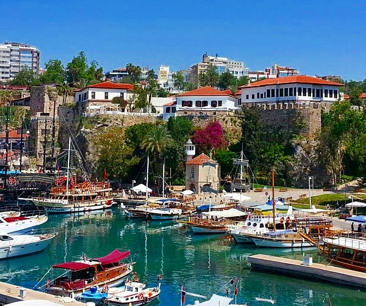
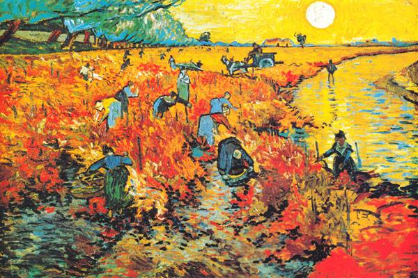
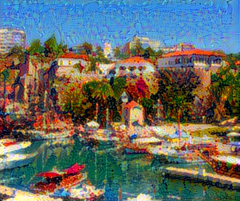
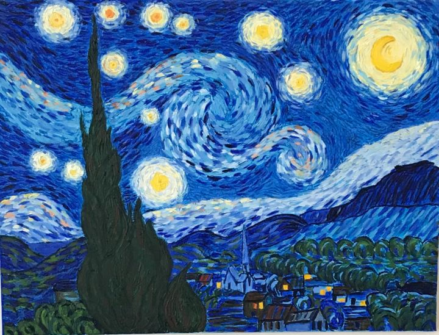
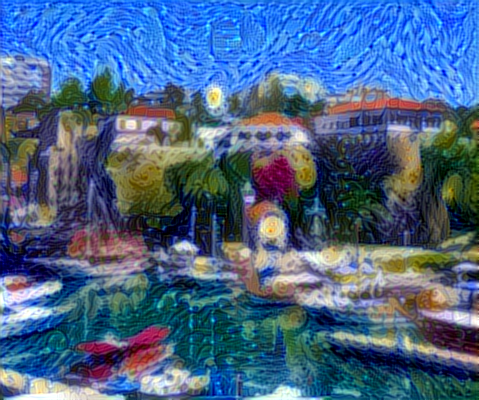
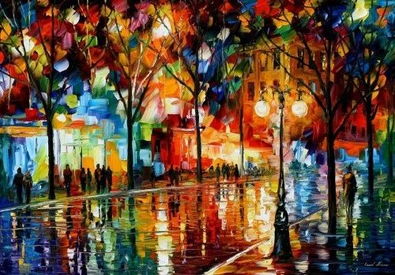
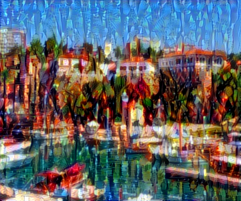

## Neural_Style_Transfer_with_VGG19

This project implements [Neural Style Transfer (NST)](https://arxiv.org/abs/1508.06576), a technique that combines the artistic style of one image with the content of another image using deep learning. I implemented it using [TensorFlow](https://www.tensorflow.org/) and the [VGG19](https://arxiv.org/abs/1409.1556) model pretrained on the [ImageNet](https://www.image-net.org/) dataset.

### Image Preprocessing

Both the base image and style image are preprocessed to have a consistent size for input to the VGG19 model. The images are loaded, resized, and converted to tensor format. The preprocessing also involves centering the pixel values and converting the images into the appropriate format for the VGG19 model.

### Loss Functions
Three types of loss functions are utilized in the project:

- Content Loss: Measures the difference in content between the base image and the generated image.
- Style Loss: Calculates the difference in style between the style image and the generated image.
- Total Variation Loss: Encourages spatial smoothness and reduces noise in the generated image.

### Hyperparameters

- variation_weight: Weight for the total variation loss. (1e-6)
- style_weight: Weight for the style loss. (1e-6)
- content_weight: Weight for the content loss. (2.5e-8)
- img_nrows: Number of rows for the processed images. (400)
- initial_learning_rate: Initial learning rate for the optimizer. (200.0)
- decay_steps: Number of steps before learning rate decay. (100)
- decay_rate: Rate of learning rate decay. (0.96)
- iterations: Number of iterations. (1000)

### Results

| Content Image | Style Image | Combined Image |
| ------------- | ----------- | -------------- |
|  |  |  |
|  |  |  |
|  |  |  |

### Usage
Clone the repository:
```bash
git clone https://github.com/denizydmr07/Neural_Style_Transfer_with_VGG19.git
cd Neural_Style_Transfer_with_VGG19
```
Run the main.py file with the following format:
```bash
python main.py /path/to/content/image.jpg /path/to/style/image.jpg /path/to/combined/image.jpg
```
